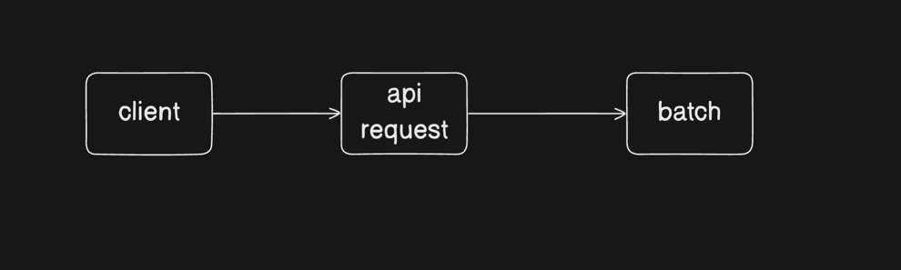
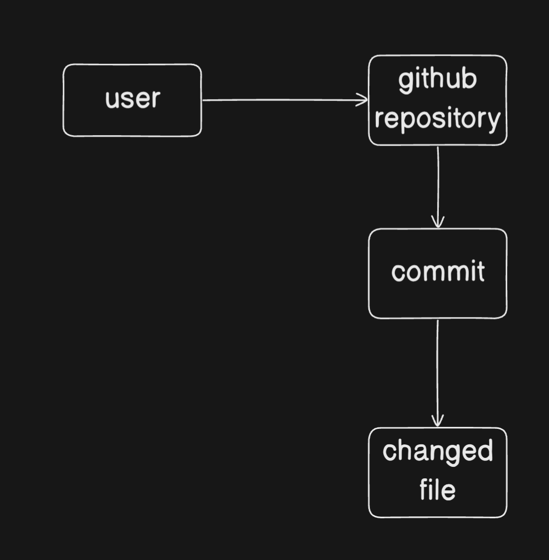

# 스프링부트3 배치 예제

스프링부트3 버전에서 `spring-batch`를 사용하여 예제를 만듭니다.   

## 간략한 spring-batch 설명

스프링에서는 `spring-batch`를 사용하여 배치작업을 할 수 있습니다.   
지금까지 배치작업을 만들면서 필요한 기능들과 구조를 만들어두어 기능을 손쉽게 사용할 수 있습니다.   

## 배치란?

사용자와 상호작용 없이도 트리거(정해진 시간, 주기 등)마다 일괄적으로 실행되는 프로세스를 의미합니다.    
월말 계산, 정기 보고서, 백업, 대량의 이메일 발송 등과 같이 수백만, 수십억 건에 이르는 대량의 데이터에 적합니다.   
대량의 데이터를 chunk 단위로 묶어 성능을 극대화하고, 실패 데이터 기록 및 재시도 등을 이용하여 데이터의 무결성과 작업 신뢰성을 보장합니다.   
또한, 대량의 데이터를 최적화된 구조로 설계하여 병렬 처리 및 분산 처리도 가능합니다.

## 예제

깃허브 레포지토리에 있는 커밋별 `changed file`들을 저장합니다.

### 요청 로직

1. 클라이언트 `api 요청`으로 `username`을 보냅니다.
2. `username`의 `github repository`에 `batch`를 수행합니다.

### 데이터 구조

- `user`는 `github repository`를 가지고 있습니다.
- `github repository`는 여러 개의 `commit`들을 가지고 있습니다.
  - 배치 작업시 모든 `commit`들을 확인해야 합니다.
- `commit`들은 여러 개의 `changed file`을 가지고 있습니다.
  - `changed file`들을 모두 저장해야 합니다.
  - `changed file`의 이름만을 저장합니다.
  - 저장시, 커밋 시간도 함께 저장합니다.

## 참조

1. [스프링 배치 - 개발자 유미 유투브](https://www.youtube.com/watch?v=MNzPsOQ3NJk&list=PLJkjrxxiBSFCaxkvfuZaK5FzqQWJwmTfR): 
스프링 배치 문서를 보기 전, 스프링 배치 동작 방식에 대해 빠르게 훑을 수 있습니다.  

2. [스프링 배치 문서 - 스프링 도큐먼트](https://docs.spring.io/spring-batch/reference/spring-batch-intro.html):
스프링 배치 구조에 대해 학습할 수 있습니다.

3. [스프링 배치 - baeldung](https://www.baeldung.com/tag/spring-batch):
문서와 함께 스프링 배치의 여러 기능에 대해 학습할 수 있습니다.

4. [스프링 배치 - josh long youtube](https://www.youtube.com/watch?v=rz1l2fpZVJQ&list=PL_HF_bzvfUwZsRO-FsjSXBU6uVOYWwGE-&index=2):
스프링 배치 최적화와 상황별 구현에 대해 살펴볼 수 있습니다.

